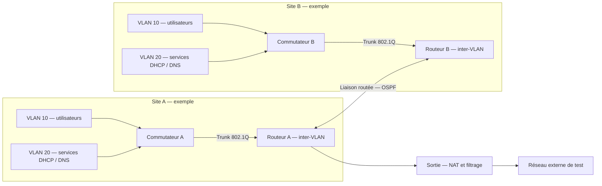

# Infrastructure réseau multi-sites — Segmentation et diagnostic

**Projet académique réalisé dans le cadre du BUT Réseaux & Télécommunications.**

Ce projet porte sur la conception d’une infrastructure réseau multi-sites intégrant des VLAN, du routage inter-VLAN, OSPF, des services DHCP/DNS, du NAT et du filtrage. Le diagnostic des communications s’appuie sur Wireshark.

Ce travail est indépendant de tout homelab et est présenté ici comme un projet académique réseau.

## Périmètre attesté

- Conception d’une infrastructure réseau multi-sites.
- VLAN et routage inter-VLAN.
- Routage dynamique OSPF.
- Services DHCP et DNS.
- NAT et filtrage.
- Diagnostic des communications avec Wireshark.

Les matériels, logiciels, versions, configurations originales et mesures ne sont pas précisés. **La topologie, le plan d’adressage, les extraits Cisco IOS et les scénarios ci-dessous sont des exemples documentaires. Ils ne représentent pas nécessairement les valeurs ou choix exacts du projet.** L’utilisation réelle de matériel Cisco n’est pas attestée.

## Objectifs

- Segmenter les usages et organiser les communications entre sites.
- Assurer le routage entre sous-réseaux et la diffusion des routes avec OSPF.
- Fournir l’adressage automatique et la résolution de noms.
- Comprendre la traduction d’adresses et appliquer une politique de filtrage.
- Localiser une panne en confrontant l’état des équipements et les paquets observés.

## Topologie logique illustrative

Deux sites sont représentés pour faciliter la lecture ; leur nombre et leurs équipements ne sont pas une description vérifiée du projet.



## Segmentation réseau — exemple de documentation

Toutes les adresses ci-dessous sont privées et illustratives. Aucune adresse n’est présentée comme une valeur historique vérifiée.

| Site | VLAN / usage | Sous-réseau d’exemple | Passerelle d’exemple |
| --- | --- | --- | --- |
| A | 10 — utilisateurs | `10.10.10.0/24` | `10.10.10.1` |
| A | 20 — services | `10.10.20.0/24` | `10.10.20.1` |
| B | 10 — utilisateurs | `10.20.10.0/24` | `10.20.10.1` |
| B | 20 — services | `10.20.20.0/24` | `10.20.20.1` |
| Interconnexion | Liaison routée, hors VLAN utilisateurs | `10.255.0.0/30` | Sans objet ; extrémités `.1` et `.2` |

Dans cet exemple, réutiliser un identifiant de VLAN sur deux sites ne signifie pas étendre le même domaine de niveau 2 : chaque site dispose de sous-réseaux distincts.

## Rôle des VLAN et routage inter-VLAN

Un VLAN délimite un domaine de diffusion de niveau 2. Les ports d’accès rattachent les postes à un VLAN ; un trunk 802.1Q transporte plusieurs VLAN entre équipements. La segmentation limite les diffusions et permet de séparer les usages.

La communication entre VLAN nécessite un équipement de niveau 3, par exemple un routeur avec des sous-interfaces ou un commutateur de niveau 3 avec des interfaces VLAN. Chaque poste utilise la passerelle de son sous-réseau. Un VLAN n’est pas, à lui seul, une politique de sécurité : le filtrage des flux routés reste nécessaire.

## OSPF

OSPF permet aux routeurs d’échanger des informations de routage et de calculer des chemins selon leurs coûts. La validation consiste à contrôler les voisinages, les réseaux annoncés et les routes installées, puis à tester les communications dans les deux sens.

Pour diagnostiquer un voisinage absent, vérifier notamment la connectivité du lien, l’aire, les temporisations, les paramètres d’authentification éventuels et l’absence de configuration passive sur la liaison d’adjacence. L’état attendu dépend du type de réseau et des rôles DR/BDR ; tous les voisins d’un réseau Ethernet ne sont pas nécessairement en état FULL entre eux.

## DHCP et DNS

DHCP fournit notamment une adresse, un masque, une passerelle et des serveurs DNS. Un serveur situé hors du sous-réseau client nécessite généralement un relais DHCP sur la passerelle, avec les flux correspondants autorisés.

DNS traduit les noms en adresses. Il faut distinguer une panne de résolution d’une panne de transport : tester une destination par son adresse puis interroger explicitement le résolveur configuré. Vérifier le bail DHCP, les options reçues, la disponibilité du service et les éventuelles erreurs DNS.

## NAT et filtrage

Le NAT traduit des adresses ; le PAT permet de partager une adresse de sortie en distinguant les flux par leurs ports. Le NAT ne remplace pas le filtrage.

Une politique de filtrage doit préciser la source, la destination, le protocole, le port, le sens et l’action. Les échanges de retour doivent être pris en compte : une ACL classique n’offre pas le suivi de session d’un pare-feu à états. Les règles exactes du projet ne sont pas publiées.

Exemple de matrice à adapter, sans prétendre à son application historique :

| Flux | Intention documentaire |
| --- | --- |
| Clients vers résolveur DNS autorisé | Autoriser UDP/53 et TCP/53 selon les besoins |
| Clients ou relais vers DHCP | Autoriser les échanges UDP/67–68 adaptés à l’architecture |
| Routeurs adjacents | Autoriser OSPF, protocole IP 89, sur la liaison prévue |
| Administration vers équipements | Restreindre aux sources et services d’administration approuvés |
| Autres échanges entre segments | Décider explicitement selon les besoins du laboratoire |

## Extraits Cisco IOS — exemples documentaires uniquement

Ces extraits partiels illustrent un site A utilisant un routeur et un commutateur séparés. Ils ne constituent pas une configuration complète ou prête à déployer. Les interfaces, fonctions et syntaxes dépendent de la plateforme et de la version IOS ; vérifier la documentation du matériel avant toute application.

Sur un commutateur de niveau 2 compatible :

```text
vlan 10
 name UTILISATEURS
vlan 20
 name SERVICES
interface GigabitEthernet0/1
 description EXEMPLE_LIAISON_ROUTEUR_A
 switchport mode trunk
 switchport trunk allowed vlan 10,20
interface GigabitEthernet0/2
 description EXEMPLE_POSTE_UTILISATEUR
 switchport mode access
 switchport access vlan 10
```

Sur le routeur A de cet exemple :

```text
interface GigabitEthernet0/0
 no shutdown
interface GigabitEthernet0/0.10
 encapsulation dot1Q 10
 ip address 10.10.10.1 255.255.255.0
interface GigabitEthernet0/0.20
 encapsulation dot1Q 20
 ip address 10.10.20.1 255.255.255.0
interface GigabitEthernet0/1
 description EXEMPLE_LIAISON_SITE_B
 ip address 10.255.0.1 255.255.255.252
 no shutdown
router ospf 1
 passive-interface default
 no passive-interface GigabitEthernet0/1
 network 10.10.10.0 0.0.0.255 area 0
 network 10.10.20.0 0.0.0.255 area 0
 network 10.255.0.0 0.0.0.3 area 0
```

Si un serveur DHCP illustratif se trouve dans le VLAN services à l’adresse `10.10.20.10`, le relais du VLAN utilisateurs pourrait être :

```text
interface GigabitEthernet0/0.10
 ip helper-address 10.10.20.10
```

Le site B, le service DHCP/DNS, le NAT, les ACL et la sortie externe doivent être configurés séparément. Ces extraits ne valident pas, à eux seuls, une communication de bout en bout.

## Commandes de validation

À exécuter uniquement sur les équipements et fonctions concernés. Les résultats attendus sont des critères de contrôle, pas des résultats obtenus pendant le projet.

| Commande Cisco IOS indicative | Point à vérifier |
| --- | --- |
| `show vlan brief` | Existence des VLAN et appartenance des ports d’accès |
| `show interfaces trunk` | État du trunk et VLAN autorisés / actifs |
| `show interfaces switchport` | Mode opérationnel des ports |
| `show ip interface brief` | Adresses et état des interfaces de niveau 3 |
| `show ip route` | Routes connectées, distantes et éventuelle route par défaut |
| `show ip route ospf` | Routes apprises par OSPF |
| `show ip ospf neighbor` | Voisins et état des adjacences |
| `show ip ospf interface` | Aire, coût, type de réseau et temporisations |
| `show ip dhcp binding` | Baux si l’équipement assure le serveur DHCP IOS |
| `show ip nat translations` | Traductions présentes après génération de trafic |
| `show ip nat statistics` | Activité NAT et interfaces concernées |
| `show access-lists` | Règles et compteurs de correspondance |
| `show ip interface` | ACL appliquées et sens d’application |

Côté client, utiliser selon le système `ipconfig /all` ou `ip address` / `ip route`, puis `ping`, `tracert` ou `traceroute` et `nslookup`. Un ping en échec ne suffit pas à conclure à une panne réseau : ICMP peut être filtré.

## Filtres d’affichage Wireshark

Exemples de filtres d’affichage, et non de filtres de capture :

| Filtre | Utilité |
| --- | --- |
| `arp` | Résolution IPv4 / MAC sur le segment observé |
| `icmp` | Requêtes, réponses et erreurs ICMP |
| `vlan.id == 10` | Trames étiquetées VLAN 10 si les tags sont visibles au point de capture |
| `ospf` | Échanges OSPF observables sur la liaison capturée |
| `udp.port == 67 || udp.port == 68` | Échanges DHCPv4 |
| `dns` | Requêtes et réponses DNS |
| `ip.addr == 10.10.10.10` | Trafic d’un hôte fictif de l’exemple |
| `tcp.analysis.retransmission` | Indices de retransmission TCP à contextualiser |

Le point de capture conditionne ce qui est visible : un poste sur un port d’accès ne voit pas nécessairement les tags VLAN ni les échanges entre routeurs. Une capture incomplète ou avec pertes peut fausser le diagnostic.

## Scénarios de panne et démarche de diagnostic

Cas documentaires sans résultat de test revendiqué :

| Symptôme | Hypothèses | Démarche de diagnostic |
| --- | --- | --- |
| Client sans bail DHCP | VLAN incorrect, trunk incomplet, relais absent, service indisponible | Vérifier le lien et le VLAN, observer les échanges DHCP, contrôler le relais et la disponibilité de la plage |
| Passerelle joignable, autre VLAN inaccessible | Route, passerelle distante ou ACL incorrecte | Contrôler interfaces de niveau 3, routes aller/retour et compteurs ACL |
| Site distant inaccessible | Liaison coupée, voisinage OSPF absent, préfixe non annoncé | Tester les extrémités du lien, examiner voisins OSPF et table de routage |
| Accès par IP possible, par nom impossible | Résolveur incorrect, service DNS ou filtrage | Contrôler les options DHCP puis les requêtes et réponses DNS |
| Sortie externe inaccessible | Route par défaut, NAT ou filtrage | Vérifier la route, générer un flux autorisé, examiner traductions et compteurs |
| Une partie des VLAN seulement est inaccessible | VLAN non autorisé sur trunk ou passerelle incorrecte | Comparer un VLAN fonctionnel et le VLAN affecté, suivre le chemin port par port |

Méthode : partir du symptôme, préciser source et destination, progresser du lien vers les services, vérifier les deux sens, ne changer qu’un paramètre à la fois et retester le flux initial. Conserver une trace anonymisée du constat, de l’hypothèse et de la vérification.

## Compétences démontrées

- Concevoir une infrastructure réseau multi-sites.
- Segmenter un réseau avec des VLAN et configurer le routage inter-VLAN.
- Mettre en œuvre OSPF et des services DHCP/DNS.
- Configurer la traduction d’adresses et le filtrage.
- Diagnostiquer les communications avec Wireshark.

## Limites et sécurité

Le dépôt ne revendique ni déploiement en production, ni haute disponibilité, ni performances mesurées. Les exemples ne sont pas des sauvegardes de configurations réelles.

Aucun secret, mot de passe, token, clé privée, IP publique sensible, donnée personnelle ou capture réelle n’est publié. Les adresses sont privées et fictives. Tout futur export de configuration ou de capture devra être examiné et anonymisé avant publication.

## Références techniques

- [Cisco IOS — commandes de vérification OSPF](https://www.cisco.com/c/en/us/td/docs/ios-xml/ios/iproute_ospf/command/iro-cr-book/m_ospf-s1.pdf)
- [Wireshark — guide utilisateur](https://www.wireshark.org/docs/wsug_html/)
- [Wireshark — référence des filtres d’affichage](https://www.wireshark.org/docs/dfref/index)
